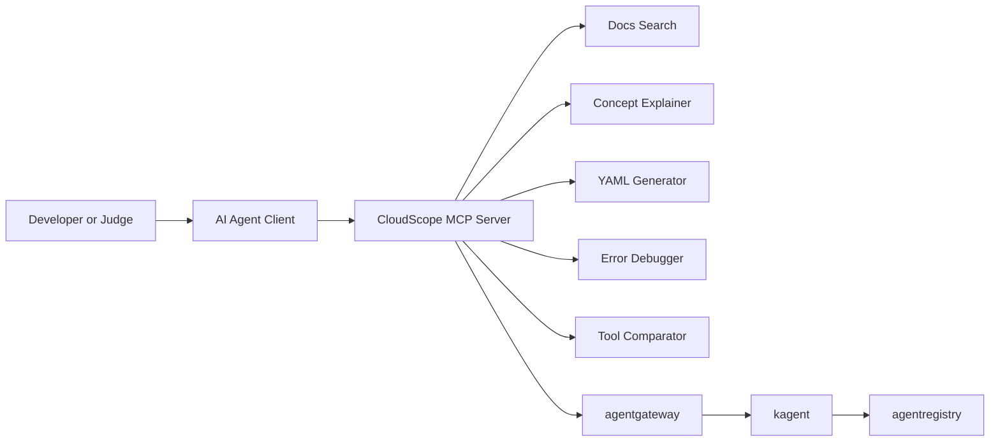

# Cloudscope-MCP-4Solo.io

CloudScope is an MCP server for cloud-native learning, built for the Solo.io AI Hackathon for MCP and AI Agents.

[](https://www.python.org/)
[](https://github.com/PrefectHQ/fastmcp)
[](LICENSE)
[](https://aihackathon.dev/)

## Demo Video

Demo video placeholder: add your final Loom or YouTube link here before submission.

## One-Liner

CloudScope is an MCP server that helps AI agents teach, search, generate, debug, and compare cloud-native workflows for Kubernetes, Docker, Helm, and adjacent tooling.

## Features

- 🔎 `search_docs`: Search official cloud-native docs with local knowledge fallback.
- 🧠 `explain_concept`: Explain 60+ concepts in plain English with analogies and commands.
- 🧱 `generate_kubernetes_yaml`: Generate production-ready Kubernetes YAML with comments.
- 🩺 `debug_kubernetes_error`: Match 40+ Kubernetes failures and return step-by-step fixes.
- ⚖️ `compare_cloud_tools`: Compare 20+ cloud-native tool pairs across five dimensions.

## Architecture Diagram



## Quick Start

```bash
python -m venv .venv
pip install -r mcp_server/requirements.txt
python mcp_server/server.py
```

Run HTTP transport when you want gateway or remote access:

```bash
python mcp_server/server.py --transport http --host 0.0.0.0 --port 8000
```

## Tool Reference

| Tool | Description | Params | Example |
| --- | --- | --- | --- |
| `search_docs` | Search official documentation for Kubernetes, Docker, Helm, Prometheus, Grafana, Istio, and Cilium. | `query`, `technology` | `search_docs("rolling update", "kubernetes")` |
| `explain_concept` | Explain a cloud-native concept with analogy, facts, and related terms. | `concept` | `explain_concept("StatefulSet")` |
| `generate_kubernetes_yaml` | Generate commented manifests for a single resource or a full app bundle. | `resource_type`, `name`, `namespace`, `options` | `generate_kubernetes_yaml("bundle", "checkout-api")` |
| `debug_kubernetes_error` | Diagnose Kubernetes errors using regex-backed pattern matching. | `error_message` | `debug_kubernetes_error("ImagePullBackOff")` |
| `compare_cloud_tools` | Compare two tools across ease of use, performance, community, fit, and learning curve. | `tool_a`, `tool_b` | `compare_cloud_tools("helm", "kustomize")` |

## kagent Integration

CloudScope ships with a ready-to-apply agent manifest:

```bash
kubectl apply -f kagent/agent.yaml
kubectl get agent -n cloudscope
```

The manifest wires a `McpServer` tool source into a kagent definition:

```yaml
tools:
  - name: cloudscope-mcp-server
    type: McpServer
    mcpServer:
      url: http://cloudscope-mcp-service:8000/mcp
      transport: http
```

## agentgateway Integration

CloudScope also includes a gateway policy example that adds:

- 60 requests per minute per IP
- Audit logging for all tool calls
- Public access for read-only tools
- `X-API-Key` enforcement for YAML generation and debugging
- CORS for development
- `/health` and `/metrics` endpoints

Apply it with:

```bash
kubectl apply -f agentgateway/gateway-config.yaml
```

## agentregistry Install

CloudScope is structured so it can be packaged cleanly for a registry-style workflow:

```bash
git clone <your-repo-url>
cd cloudscope
python -m venv .venv
pip install -r mcp_server/requirements.txt
python mcp_server/server.py
```

For the Kubernetes path:

```bash
kubectl apply -f kagent/agent.yaml
kubectl apply -f agentgateway/gateway-config.yaml
```

## Web Demo

Open the single-file dashboard in any browser:

```bash
start web/cloudscope-dashboard.html
```

The dashboard includes:

- Hero typing animation for Kubernetes, Docker, Helm, Istio, and Prometheus
- Animated User → Agent → MCP → Tools flow
- Five interactive demo tabs with mock async tool runs
- YAML syntax highlighting via `highlight.js`
- Integration snippets for kagent, agentgateway, and agentregistry

## Project Structure

```text
.
├── agentgateway/
│   └── gateway-config.yaml
├── docs/
│   └── tutorial.md
├── kagent/
│   └── agent.yaml
├── mcp_server/
│   ├── server.py
│   ├── requirements.txt
│   └── tools/
│       ├── concept_explainer.py
│       ├── docs_search.py
│       ├── error_debugger.py
│       ├── tool_comparator.py
│       └── yaml_generator.py
└── web/
    └── cloudscope-dashboard.html
```

## Development Guide

Useful local commands:

```bash
python -m compileall mcp_server
python mcp_server/server.py
python mcp_server/server.py --transport http
```

If you want to open the dashboard, just load `web/cloudscope-dashboard.html` in a browser. No frontend build step is required.

## Claude Desktop Setup

Use this JSON snippet in a local MCP-capable desktop client:

```json
{
  "mcpServers": {
    "cloudscope": {
      "command": "python",
      "args": ["mcp_server/server.py"]
    }
  }
}
```

## Tutorial

The long-form build and integration walkthrough lives at [docs/tutorial.md](docs/tutorial.md).

## Contributing

Contributions are welcome if they improve cloud-native accuracy, MCP ergonomics, demo quality, or docs clarity.

Good contribution areas:

- Expand concept coverage
- Improve official-doc parser quality
- Add more Kubernetes error patterns
- Improve gateway policy realism
- Strengthen dashboard polish for demos

## MIT License

This project is released under the MIT License. See [LICENSE](LICENSE) for the full text.

## Acknowledgments

- Solo.io for the AI Hackathon for MCP and AI Agents
- Anthropic for pushing practical MCP workflows into real tooling discussions
- kagent for the Kubernetes agent runtime direction
- agentgateway for the governance story around agent traffic
- FastMCP for keeping MCP server authoring straightforward
